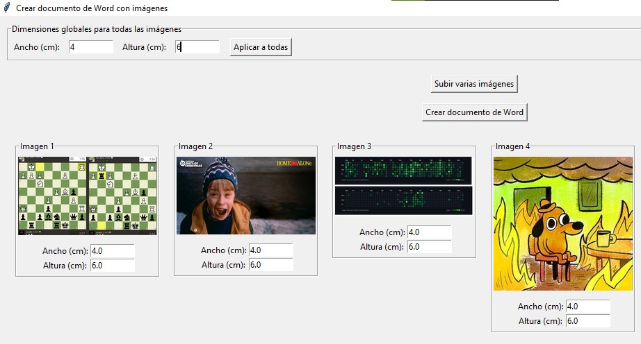

# Word Document Creator App
This is a python-based project to create a Microsoft Word document with images of a specific image size. It is a real application that is useful for the people who works on "cyber coffes" which is  a popular service in Ecuador where people do the printing of documents and just send the pictures to the worker with the desired image size. This program uses python-docx to create the Microsoft Word document and tkinter for the GUI.

## How to run
Since this app is developed with tkinter, it can be run with the comand `python app.py`

## App building
The app is build with pyinstaller and the single executable file can be created with the following command:  
`pyinstaller --onefile --windowed --add-data "C:\\Users\\user\\anaconda3\\envs\\py_tkinter\\lib\\site-packages\\PIL;PIL" --add-data "C:\\Users\\user\\anaconda3\\envs\\py_tkinter\\lib\\site-packages\\docx;docx" --add-data "C:\\Users\\user\\anaconda3\\envs\\py_tkinter\\lib\\site-packages\\lxml;lxml" --add-data "C:\\Users\\user\\anaconda3\\envs\\py_tkinter\\lib\\site-packages\\PIL;." app.py`  
It is important the flag `--onefile` so the result is only one executable file.

## App Usage
The first step is to add all the images to create the Word document, then the user has to specify the size in width("ancho" in spanish) and height("altura" in spanish) of each image or use the "Global dimensiones" button to specify the width and height for all the images.

